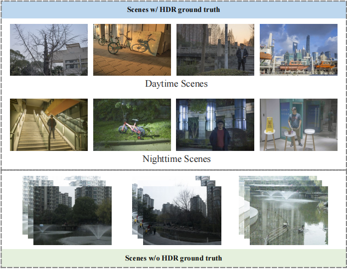

# High Dynamic Range Imaging from RAW Domain with a New benchmark dataset and a Multi-scale
### By [Yong Shu](https://github.com/syujung), [Liquan Shen](..), [Xiangyu Hu](..), [Zihao Zhou](..) ###

## A benchmark dataset for HDR Reconstruction from RAW domain

    

## Download dataset
We provide the original raw data to facilitate the research on HDR imaging.

|              |                        Baidu Netdisk                         |                         Google Drive                        | Description                                                  |
| :----------- | :----------------------------------------------------------: | :----------------------------------------------------------: | ------------------------------------------------------------ |
| RAW-HDR |   RAW Dataset in [link](https://pan.baidu.com/s/1J9Hr-TkFTkDcjGh9NS?) code:acce | todo | The original RAW version dataset (.CR3 file). |

## Copyright

Our RAW-HDR dataset is available for the academic purpose only.                                                   

